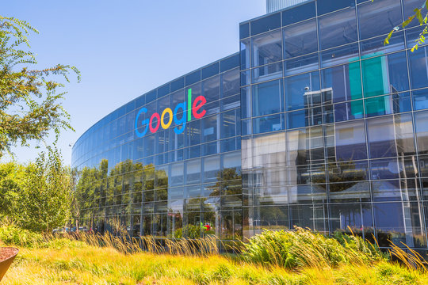

# 🌐 Web Portfolio Workshop (Using Figma Dev Mode)

Welcome to the Web Portfolio Workshop! In this hands-on session, you’ll build a professional portfolio using HTML/CSS and Figma Dev Mode. We'll take it step by step:

🔁 **For every section:**
1. Build the HTML structure  
2. Paste the CSS styles from Figma  
3. Modify the CSS as needed

---

## ✅ Setup Instructions

Before we start coding, make sure you have the following:

### 📁 1. Download the Assets
Grab the `assets/` folder provided. It includes:
- Images (headshots, logos, etc.)
- Icons (LinkedIn)

### 💻 2. Install VS Code
Download: https://code.visualstudio.com/

### 🔌 3. Install Live Server Extension
In VS Code:
- Go to Extensions (`Ctrl+Shift+X`)
- Search for **Live Server**
- Click **Install**

---

## 🧭 Navbar

### 1️⃣ HTML Skeleton

```html
<div id="navbar-container">
  <div id="navbar">
    <div id="nameplate">
      
      <p>Jerry Chalamet</p>
    </div>
    <div id="pages">
      <p>About</p>
      <p>Experience</p>
      <p>Resume</p>
      <a href="https://www.linkedin.com/in/jasontenczar/">
        
      </a>
    </div>
  </div>
</div>
```

### 2️⃣ CSS from Figma + Google Fonts

```css
@import url('https://fonts.googleapis.com/css2?family=Roboto:ital,wght@0,100..900;1,100..900&display=swap');

body {
  font-family: 'Roboto', sans-serif;
  background-color: #FAFAFA;
  margin: 0;
  padding: 0;
}
```

### 3️⃣ Navbar Styles

```css
#navbar-container {
  display: flex;
  justify-content: center;
  align-items: center;
}

#navbar {
  margin-top: 10px;
  border-radius: 40px;
  display: flex;
  justify-content: space-between;
  align-items: center;
  flex-direction: row;
  width: 80%;
  padding-left: 6px;
  padding-right: 14px;
  box-sizing: border-box;
  box-shadow: 0px 8px 30px rgba(0, 0, 0, 0.2);
}

#small-headshot {
  width: 52px;
  height: 52px;
  border-radius: 26px;
  object-fit: cover;
}

#nameplate {
  display: flex;
  align-items: center;
  gap: 10px;
  justify-content: center;
}

#pages {
  display: flex;
  align-items: center;
  gap: 50px;
}
```

---

## 🦸‍♂️ Hero Section

### 1️⃣ HTML Skeleton

```html
<div id="hero">
  <div id="hero-text">
    <h1>Jerry Chalamet</h1>
    <p>Software Engineer from San Francisco, California with experience in Frontend & Backend technologies.
       Pursuing a Master’s degree in Computer Science at the University of Florida.
    </p>
  </div>
  <div id="hero-image">
    
  </div>
</div>
```

### 2️⃣ Figma Styles

```css
h1 {
  color: #161616;
  font-size: 80px;
  font-weight: 600;
}

p {
  color: #161616;
  font-size: 18px;
  font-weight: 400;
}
```

### 3️⃣ Modified CSS

```css
#hero {
  width: 100%;
  display: inline-flex;
  align-items: center;
  justify-content: center;
  gap: 87px;
  margin-top: 100px;
}

#hero-text {
  display: flex;
  width: 553px;
  flex-direction: column;
  align-items: flex-start;
  gap: 60px;
}

#hero-image img {
  width: 400px;
  height: 400px;
  border-radius: 20px;
  object-fit: cover;
  box-shadow: 0px 275px 77px rgba(0, 0, 0, 0.00), 0px 44px 44px rgba(0, 0, 0, 0.09), 0px 11px 24px rgba(0, 0, 0, 0.10);
}
```

---

## 🃏 Experience Cards

### 1️⃣ HTML Skeleton

```html
<div id="experiences">
  <div class="card">
    <div class="card-text">
      <div class="card-body">
        <div class="card-company">
          
          <h2>Google</h2>
        </div>
        <p>Interned during the Summer of 2023 in Mountain View, California.</p>
      </div>
      <p>Software Developer</p>
    </div>
    <div>
      
    </div>
  </div>
</div>
```

💡 **To duplicate a card**, copy the `.card` block and update the content/image/logo.

### 2️⃣ Figma Styles

```css
h2 {
  font-size: 40px;
  font-weight: 600;
}
```

### 3️⃣ Modified CSS

```css
#experiences {
  display: flex;
  flex-direction: column;
  gap: 103px;
  width: 100%;
  margin-top: 100px;
  align-items: center;
  justify-content: center;
}

.card {
  display: flex;
  height: 392px;
  padding: 25px 26px 25px 61px;
  align-items: center;
  gap: 106px;
  border-radius: 40px;
  background: #FAFAFA;
  width: 80%;
  margin: auto;
  box-shadow: 0px 715px 200px rgba(0, 0, 0, 0.00), 0px 29px 63px rgba(0, 0, 0, 0.10);
}

.card-text {
  display: flex;
  width: 336px;
  height: 275px;
  flex-direction: column;
  justify-content: space-between;
  align-items: flex-start;
}

.card-body {
  display: flex;
  flex-direction: column;
  align-items: flex-start;
  gap: 22px;
}

.card-company {
  display: flex;
  align-items: center;
  gap: 11px;
}

.card-logo {
  width: 49px;
  height: 49px;
  object-fit: cover;
}

.card-image {
  width: 511px;
  height: 341px;
  border-radius: 20px;
  object-fit: cover;
}
```

---

## 📩 Footer

### 1️⃣ HTML Skeleton

```html
<div id="footer">
  <p>👋 Hello there</p>
</div>
```

### 2️⃣ CSS

```css
#footer {
  margin-top: 100px;
  display: flex;
  align-items: center;
  justify-content: center;
}
```

---

## 🚀 Launch Instructions

1. Open `index.html` in VS Code  
2. Right-click → **Open with Live Server**  
3. Your portfolio should now be running at `localhost:5500`

---

Happy coding! 🎉
